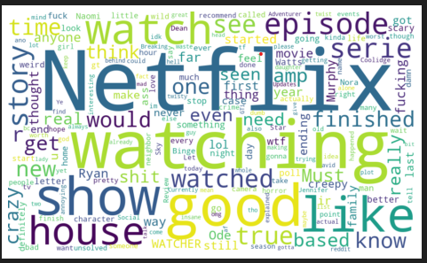
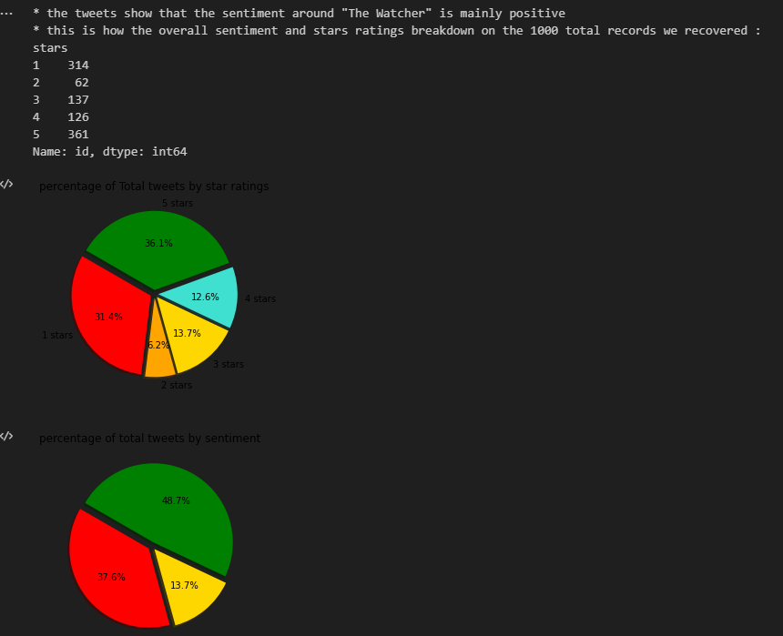
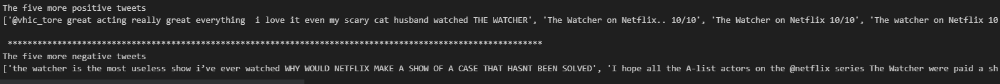

## Twitter Sentiment Analysis Project
### Overview
This project uses the Twitter API to collect tweets related to a specific keyword and analyzes the sentiment of the tweets using a BERT model. The keyword can be easily changed to analyze sentiment for different topics. The results of the analysis include a report of the percentage of tweets with positive, negative, and neutral sentiment, as well as a word cloud visualization.

### Installation
* Clone this repository to your local machine.
* Install the required Python packages listed in the requirements.txt file using pip:
* pip install -r requirements.txt
* Create a Twitter Developer Account and obtain API keys and tokens for accessing the Twitter API.
* Enter your API keys and tokens in the config.ini file.

### Usage
* Modify the keyword in the twitter_sentiment.ipynb file line: 
    tweets= get_tweets('The Watcher',language='en',num_tweets=1000). In this case, the default keyword is "The Watcher" for analyzing sentiment related to the mini-series.
* Then to run the sentiment analysis, execute the twitter_sentiment.ipynb file:

The program will collect tweets using the Twitter API and analyze their sentiment using a BERT model. The output will include a report of the percentage of tweets with positive, negative, and neutral sentiment, as well as a word cloud visualization.

### Output
The output of the sentiment analysis will include:

A report with the percentage of tweets with positive, negative, and neutral sentiment, as well as the average star rating based on the sentiment.
A word cloud visualization of the most frequent words used in the tweets. Also the text of the five most positive tweets and the five most negative ones.

### Examples
Here are some example screenshots of the output:

Word Cloud Visualization

Sentiment Report

License
This project is licensed under the MIT License - see the LICENSE file for details